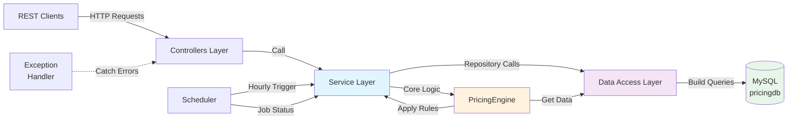
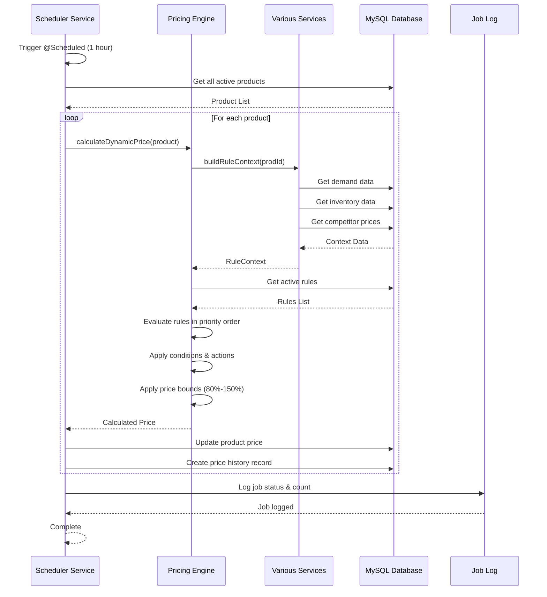
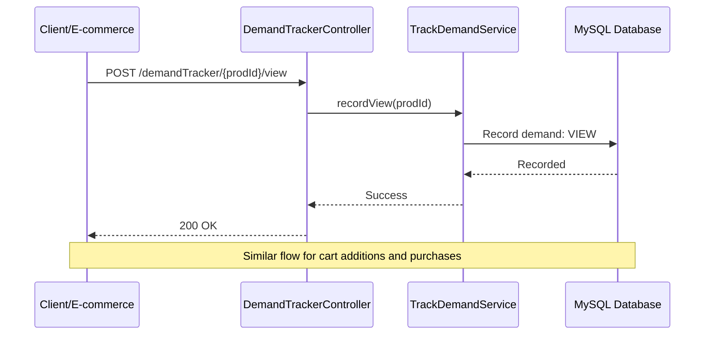
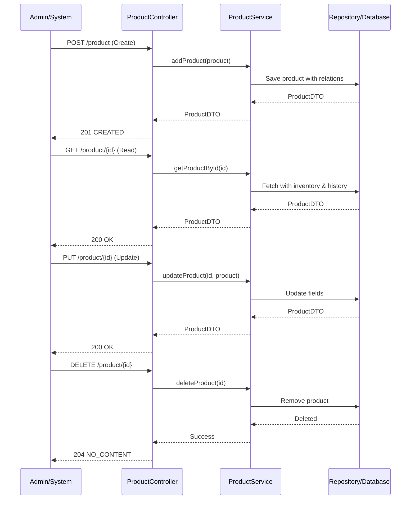
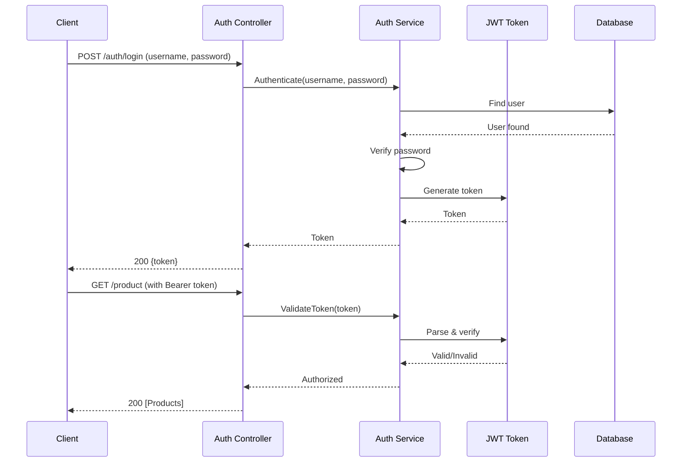
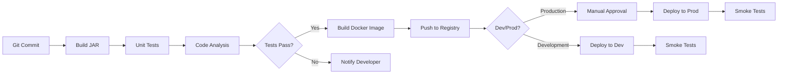

# Dynamic Pricing System (DPS)

A sophisticated, rule-driven dynamic pricing engine that automatically calculates and updates product prices based on market demand, inventory levels, competitor pricing, and configurable business rules. Designed for e-commerce and retail platforms to optimize revenue through intelligent price optimization.

---

## Table of Contents

1. [Project Overview](#project-overview)
2. [Technology Stack](#technology-stack)
3. [High-Level Architecture](#high-level-architecture)
4. [Application Flow](#application-flow)
5. [Project Structure](#project-structure)
6. [Database Design](#database-design)
7. [Entity Relationship Diagram](#entity-relationship-diagram)
8. [API Documentation](#api-documentation)
9. [Configuration](#configuration)
10. [Security](#security)
11. [Deployment Guide](#deployment-guide)
12. [Logging and Monitoring](#logging-and-monitoring)
13. [Design Decisions](#design-decisions)
14. [Future Improvements](#future-improvements)
15. [Appendix](#appendix)

---

## Project Overview

### Project Name
**Dynamic Pricing System (DPS)**

### Purpose
The DPS is an intelligent pricing optimization platform that dynamically adjusts product prices in real-time based on multiple factors including demand patterns, inventory levels, competitor pricing, and predefined business rules. It provides REST APIs for product management, inventory tracking, demand monitoring, and price history auditing.

### Business Problem Solved
- **Revenue Optimization**: Maximize profit margins by pricing products optimally based on demand elasticity
- **Competitive Pricing**: Monitor competitor prices and adjust pricing strategy accordingly
- **Inventory Management**: Reduce excess inventory or increase prices when stock is low
- **Market Responsiveness**: React to demand fluctuations in real-time
- **Demand Tracking**: Record and analyze customer behavior (views, cart additions, purchases)
- **Price History Auditing**: Maintain complete audit trail of all price changes

### Key Features

| Feature | Description |
|---------|-------------|
| **Dynamic Price Calculation** | Rule-based pricing engine that adjusts prices based on real-time market conditions |
| **Rule Engine** | Flexible, priority-based rule system with support for complex conditions and actions |
| **Demand Tracking** | Record product views, cart additions, and purchases to calculate demand scores |
| **Competitor Monitoring** | Track competitor prices and incorporate them into pricing decisions |
| **Inventory Integration** | Factor inventory levels into price calculations (higher prices when stock is low) |
| **Price History** | Complete audit trail of all price changes with timestamps and trigger information |
| **Scheduled Pricing** | Automated hourly pricing updates with job logging and status tracking |
| **RESTful APIs** | Comprehensive REST API for all operations and queries |
| **Exception Handling** | Global exception handling with standardized error responses |

### Target Users
- **E-commerce Platforms**: Online retailers managing multi-product catalogs
- **Retail Operations Teams**: Pricing managers and business analysts
- **System Administrators**: Infrastructure and application support teams
- **Developers**: Teams integrating with or extending the pricing system

---

## Technology Stack

| Layer | Technology | Version | Purpose |
|-------|-----------|---------|---------|
| **Language** | Java | 21 | Core programming language |
| **Framework** | Spring Boot | 4.0.6 | Microservice/REST API framework |
| **Data Access** | Spring Data JPA | 4.0.6 | ORM abstraction layer |
| **ORM** | Hibernate | (via Spring Data) | Object-relational mapping |
| **Database** | MySQL | 8.0+ | Relational database |
| **Database Driver** | MySQL Connector/J | Latest | JDBC driver for MySQL |
| **Build Tool** | Maven | 3.8+ | Project build and dependency management |
| **Dependency Library** | Lombok | Latest | Reduces boilerplate code (getters/setters) |
| **Logging** | SLF4J + Logback | (Built-in Spring) | Application logging framework |
| **JSON Processing** | Jackson | (Built-in Spring) | JSON serialization/deserialization |
| **Scheduling** | Spring Task Scheduling | 4.0.6 | Scheduled job execution |
| **Testing** | JUnit 5 + Spring Boot Test | 4.0.6 | Unit and integration testing |
| **Rest Client** | Spring Rest Templates | (Built-in Spring) | HTTP client for external APIs |
| **Java Version** | OpenJDK/JDK | 21 | Java runtime environment |

### Build and Configuration Tools
- **Maven**: Version 3.8.1+ (wrapper provided: mvnw.cmd for Windows, mvnw for Unix)
- **Target Directory**: Compiled classes in `target/` folder
- **Spring Profiles**: Development (default) and Production profiles supported

---

## High-Level Architecture

### Architecture Overview

The DPS follows a **layered, service-oriented architecture** designed for modularity, maintainability, and scalability:

```
┌─────────────────────────────────────────────────────────────┐
│                    REST Clients / UI                        │
│         (E-commerce Platform, Admin Dashboard, etc)        │
└──────────────────────┬──────────────────────────────────────┘
                       │
┌──────────────────────▼──────────────────────────────────────┐
│              REST API Layer (Controllers)                    │
│  ┌──────────────────────────────────────────────────────┐  │
│  │ ProductController │ InventoryController               │  │
│  │ PriceHistoryController │ DemandTrackerController     │  │
│  │ SchedulerController │ (All Spring @RestController)  │  │
│  └──────────────────────────────────────────────────────┘  │
└──────────────────────┬──────────────────────────────────────┘
                       │
┌──────────────────────▼──────────────────────────────────────┐
│          Service Layer (Business Logic)                      │
│  ┌──────────────────────────────────────────────────────┐  │
│  │ PricingEngine (Core Logic)                            │  │
│  │ ProductService      │ InventoryService              │  │
│  │ DemandService       │ TrackDemandService            │  │
│  │ RuleService         │ CompPricingService            │  │
│  │ SchedulerService    │ JobLogService                 │  │
│  │ PriceHistoryService │ (Business logic layer)        │  │
│  └──────────────────────────────────────────────────────┘  │
└──────────────────────┬──────────────────────────────────────┘
                       │
┌──────────────────────▼──────────────────────────────────────┐
│       Repository/Data Access Layer (Spring Data JPA)        │
│  ┌──────────────────────────────────────────────────────┐  │
│  │ ProductRepo │ InventoryRepo │ DemandRepo            │  │
│  │ RulesRepo │ CompPricingRepo │ TrackProductDemandRepo │  │
│  │ PriceHistoryRepo │ JobLogRepo │ (Spring Repositories) │  │
│  └──────────────────────────────────────────────────────┘  │
└──────────────────────┬──────────────────────────────────────┘
                       │
┌──────────────────────▼──────────────────────────────────────┐
│            MySQL Database (pricingdb)                        │
│  ┌──────────────────────────────────────────────────────┐  │
│  │ Tables: product, inventory, demand, competitor       │  │
│  │         price_history, rules, comp_pricing           │  │
│  │         track_prod_demand, job_log, users            │  │
│  └──────────────────────────────────────────────────────┘  │
└──────────────────────────────────────────────────────────────┘
```

### Architecture Components

#### 1. **REST API Layer (Controllers)**
- Entry point for all client requests
- Handles HTTP request validation and routing
- Returns standardized JSON responses
- Controllers:
  - `ProductController`: CRUD operations for products
  - `InventoryController`: Inventory management and restocking
  - `PriceHistoryController`: Price history queries
  - `DemandTrackerController`: Record customer demand signals
  - `SchedulerController`: Trigger manual pricing runs

#### 2. **Service Layer (Business Logic)**
- Implements core business logic and algorithms
- Orchestrates multiple repositories for complex operations
- Contains the sophisticated **PricingEngine** component

**Key Services:**
- **PricingEngine**: Calculates dynamic prices using the rule engine
  - Builds context with demand scores, inventory, competitor prices
  - Evaluates rules in priority order
  - Applies bounded price adjustments (80% - 150% of base price)
  
- **SchedulerService**: Manages hourly automated pricing updates
  - Runs every 3600000ms (1 hour)
  - Iterates through active products
  - Logs job execution status and products updated
  
- **RuleService**: Manages dynamic pricing rules
- **TrackDemandService**: Records demand signals
- **CompPricingService**: Manages competitor pricing data
- Other supporting services

#### 3. **Repository/Data Access Layer**
- Spring Data JPA repositories for database operations
- Automatic CRUD operations
- Custom query methods for complex data retrieval
- No raw SQL required

#### 4. **Database Layer**
- **Primary Database**: MySQL (pricingdb)
- **Connection Pool**: HikariCP (default Spring Boot)
- **ORM**: Hibernate with Spring Data JPA
- **Naming Strategy**: CamelCase to Underscore conversion

#### 5. **Exception Handling**
- Global exception handler using `@ControllerAdvice`
- Standardized error responses with HTTP status codes
- Custom exceptions for different error scenarios

### Mermaid Architecture Diagram



---

## Application Flow

### Flow 1: Dynamic Price Calculation & Update (Scheduled)

#### Description
Every hour, the system automatically calculates and updates prices for all active products based on real-time conditions and configured rules.

#### Sequence Diagram



#### Price Calculation Algorithm

1. **Get Base Price**: Use minimum of base price and discounted price
2. **Build Context**:
   - Calculate demand score from demand tracking data
   - Get current inventory stock count
   - Calculate competitor price difference (%)
3. **Retrieve Active Rules**: Get rules with `isActive = true` sorted by priority
4. **Evaluate & Apply Rules**:
   - For each rule in priority order:
     - Evaluate condition (field: demandScore, stockCount, competitorDiff)
     - Operator support: GT (>), LT (<), EQ (=)
     - If condition true, apply action: MULTIPLY, ADD, or SET
5. **Apply Price Bounds**: Ensure calculated price stays within 80%-150% of base price
6. **Persist**: Update product dynamic price and create price history record

### Flow 2: Record Demand Signal (Product View/Cart/Purchase)

#### Description
When customer views, adds to cart, or purchases a product, the demand tracking system records this activity for future price calculation.

#### Sequence Diagram



### Flow 3: Update Product Information

#### Description
Create, read, update, or delete product information used in pricing calculations.

#### Sequence Diagram



### Flow 4: Restock Inventory

#### Description
Update inventory quantities when products are restocked.

#### Flow Steps
1. Client sends PATCH request with quantity to `/{prodId}/restock`
2. InventoryController receives request
3. Service updates product inventory count in database
4. Response returned to client

---

## Project Structure

```
dps/
├── mvnw / mvnw.cmd              # Maven wrapper (Unix/Windows)
├── pom.xml                       # Maven configuration & dependencies
├── README.md                     # This documentation
├── HELP.md                       # Spring Boot help documentation
├── src/
│   ├── main/
│   │   ├── java/com/example/dps/
│   │   │   ├── DpsApplication.java          # Main Spring Boot entry point
│   │   │   │
│   │   │   ├── controller/                  # REST API Endpoints
│   │   │   │   ├── ProductController.java              # Product CRUD APIs
│   │   │   │   ├── InventoryController.java            # Inventory management
│   │   │   │   ├── PriceHistoryController.java         # Price history queries
│   │   │   │   ├── DemandTrackerController.java        # Demand tracking APIs
│   │   │   │   └── SchedulerController.java            # Manual scheduler trigger
│   │   │   │
│   │   │   ├── service/                    # Business Logic Layer
│   │   │   │   ├── PricingEngine.java                  # Core pricing algorithm
│   │   │   │   ├── SchedulerService.java               # Scheduled pricing updates
│   │   │   │   ├── ProductService.java                 # Product operations
│   │   │   │   ├── InventoryService.java               # Inventory operations
│   │   │   │   ├── DemandService.java                  # Demand score calculation
│   │   │   │   ├── TrackDemandService.java             # Demand tracking
│   │   │   │   ├── CompPricingService.java             # Competitor pricing
│   │   │   │   ├── RuleService.java                    # Rule management
│   │   │   │   ├── PriceHistoryService.java            # Price history queries
│   │   │   │   └── JobLogService.java                  # Job execution logs
│   │   │   │
│   │   │   ├── repository/                 # Data Access Layer (Spring Data JPA)
│   │   │   │   ├── ProductRepo.java                    # Product repository
│   │   │   │   ├── InventoryRepo.java                  # Inventory repository
│   │   │   │   ├── DemandRepo.java                     # Demand repository
│   │   │   │   ├── RulesRepo.java                      # Rules repository
│   │   │   │   ├── CompPricingRepo.java                # Competitor pricing repo
│   │   │   │   ├── TrackProductDemandRepo.java         # Product demand tracking repo
│   │   │   │   ├── PriceHistoryRepo.java               # Price history repository
│   │   │   │   └── JobLogRepo.java                     # Job log repository
│   │   │   │
│   │   │   ├── entity/                    # JPA Entities (Database Models)
│   │   │   │   ├── Product.java                        # Product entity
│   │   │   │   ├── Inventory.java                      # Inventory entity
│   │   │   │   ├── Demand.java                         # Demand entity
│   │   │   │   ├── PriceHistory.java                   # Price history entity
│   │   │   │   ├── Rules.java                          # Pricing rules entity
│   │   │   │   ├── Competitor.java                     # Competitor entity
│   │   │   │   ├── CompPricing.java                    # Competitor pricing entity
│   │   │   │   ├── CompPricingId.java                  # Composite key for CompPricing
│   │   │   │   ├── TrackProdDemand.java                # Product demand tracking entity
│   │   │   │   ├── JobLog.java                         # Job execution log entity
│   │   │   │   └── Users.java                          # User entity (for future auth)
│   │   │   │
│   │   │   ├── dto/                       # Data Transfer Objects
│   │   │   │   ├── ProductDTO.java                     # Product DTO
│   │   │   │   ├── HistoryDTO.java                     # Price history DTO
│   │   │   │   ├── JobDTO.java                         # Job execution DTO
│   │   │   │   ├── RuleContext.java                    # Rule evaluation context
│   │   │   │   ├── PurchaseRequest.java                # Purchase request DTO
│   │   │   │   └── RestockRequest.java                 # Restock request DTO
│   │   │   │
│   │   │   ├── exception/                 # Custom Exception Handling
│   │   │   │   ├── GlobalExceptionHandler.java         # Global @ControllerAdvice
│   │   │   │   ├── ResourceNotFoundException.java      # Resource not found (404)
│   │   │   │   ├── ConflictException.java              # Conflict errors (409)
│   │   │   │   └── BadRequestException.java            # Bad request errors (400)
│   │   │   │
│   │   │   └── utils/                    # Utility Classes
│   │   │       └── Constants.java                      # Application constants
│   │   │
│   │   └── resources/
│   │       ├── application.properties      # Spring Boot configuration
│   │       ├── static/                     # Static assets (CSS, JS, images)
│   │       └── templates/                  # Thymeleaf templates (if needed)
│   │
│   └── test/
│       └── java/com/example/dps/
│           └── DpsApplicationTests.java    # Integration/Spring context tests
│
└── target/                          # Compiled output (generated after build)
    ├── classes/
    ├── generated-sources/
    └── [Maven build artifacts]
```

### Folder Responsibilities

| Folder | Responsibility |
|--------|-----------------|
| **controller/** | Handles HTTP requests, validates input, returns responses |
| **service/** | Implements business logic, orchestrates repositories, calculations |
| **repository/** | Provides database access abstraction via Spring Data JPA |
| **entity/** | JPA annotated classes representing database tables |
| **dto/** | Plain objects for data transfer between layers |
| **exception/** | Custom exception classes and global exception handling |
| **utils/** | Reusable constants and utility functions |
| **resources/** | Configuration files and static assets |

---

## Database Design

### Complete Database Schema

The application uses **MySQL** with 11 primary tables and relationships. All tables use InnoDB storage engine.

#### Table: PRODUCT

| Column | Data Type | Nullable | Default | Key | Description |
|--------|-----------|----------|---------|-----|-------------|
| prod_id | INT | NO | AUTO_INCREMENT | PK | Product unique identifier |
| prod_name | VARCHAR(255) | YES | NULL | | Product name |
| prod_category | VARCHAR(255) | YES | NULL | | Product category |
| prod_company_name | VARCHAR(255) | YES | NULL | | Manufacturer/Company name |
| base_price | DECIMAL(10,2) | YES | NULL | | Original base price |
| current_dynamic_price | DECIMAL(10,2) | YES | NULL | | Current calculated price |
| discounted_price | DECIMAL(10,2) | YES | NULL | | Current discounted price |
| is_active | BOOLEAN | YES | NULL | | Flag for active products |

**Indexes**: PRIMARY KEY (prod_id)  
**Relations**: ONE-TO-ONE with INVENTORY, ONE-TO-MANY with PRICE_HISTORY, MANY-TO-MANY with COMPETITOR via COMP_PRICING

---

#### Table: INVENTORY

| Column | Data Type | Nullable | Default | Key | Description |
|--------|-----------|----------|---------|-----|-------------|
| prod_id | INT | NO | | PK/FK | Foreign key to PRODUCT |
| prod_count | INT | YES | NULL | | Current stock count |

**Indexes**: PRIMARY KEY (prod_id)  
**Foreign Keys**: prod_id → PRODUCT.prod_id (CASCADE)  
**Relations**: ONE-TO-ONE with PRODUCT

---

#### Table: DEMAND

| Column | Data Type | Nullable | Default | Key | Description |
|--------|-----------|----------|---------|-----|-------------|
| demand_id | INT | NO | AUTO_INCREMENT | PK | Demand type identifier |
| demand_name | VARCHAR(255) | YES | NULL | | Demand type name (VIEW, CART, PURCHASE) |
| demand_value | INT | YES | NULL | | Numeric weight for demand calculation |

**Indexes**: PRIMARY KEY (demand_id)  
**Relations**: ONE-TO-MANY with TRACK_PROD_DEMAND

---

#### Table: TRACK_PROD_DEMAND

| Column | Data Type | Nullable | Default | Key | Description |
|--------|-----------|----------|---------|-----|-------------|
| track_id | INT | NO | AUTO_INCREMENT | PK | Tracking record identifier |
| prod_id | INT | YES | NULL | FK | Foreign key to PRODUCT |
| demand_id | INT | YES | NULL | FK | Foreign key to DEMAND |
| demand_count | INT | YES | NULL | | Number of demand events |
| recorded_at | TIMESTAMP | NO | CURRENT_TIMESTAMP | | When the record was created |

**Indexes**: PRIMARY KEY (track_id), FOREIGN KEY (prod_id), FOREIGN KEY (demand_id)  
**Foreign Keys**: prod_id → PRODUCT.prod_id, demand_id → DEMAND.demand_id  
**Relations**: MANY-TO-ONE with PRODUCT, MANY-TO-ONE with DEMAND

---

#### Table: PRICE_HISTORY

| Column | Data Type | Nullable | Default | Key | Description |
|--------|-----------|----------|---------|-----|-------------|
| history_id | INT | NO | AUTO_INCREMENT | PK | History record identifier |
| prod_id | INT | YES | NULL | FK | Foreign key to PRODUCT |
| base_price | DECIMAL(10,2) | YES | NULL | | Base price at time of change |
| discounted_price | DECIMAL(10,2) | YES | NULL | | Discounted price at time of change |
| comp_price | DECIMAL(10,2) | YES | NULL | | Average competitor price at change |
| calculated_at | TIMESTAMP | NO | CURRENT_TIMESTAMP | | When price was calculated |
| triggered_by | VARCHAR(255) | YES | NULL | | What triggered the price change |

**Indexes**: PRIMARY KEY (history_id), FOREIGN KEY (prod_id)  
**Foreign Keys**: prod_id → PRODUCT.prod_id (CASCADE)  
**Relations**: MANY-TO-ONE with PRODUCT

---

#### Table: RULES

| Column | Data Type | Nullable | Default | Key | Description |
|--------|-----------|----------|---------|-----|-------------|
| rule_id | INT | NO | AUTO_INCREMENT | PK | Rule identifier |
| rule_name | VARCHAR(255) | YES | NULL | | Descriptive rule name |
| rule_condition | JSON | YES | NULL | | Condition JSON: {"field":"demandScore","operator":"GT","value":300} |
| action_name | VARCHAR(50) | YES | NULL | | Action: MULTIPLY, ADD, or SET |
| action_value | DECIMAL(10,2) | YES | NULL | | Value for the action |
| priority | INT | YES | NULL | | Execution priority (lower number = higher priority) |
| is_active | BOOLEAN | YES | NULL | | Whether rule is active |

**Indexes**: PRIMARY KEY (rule_id)  
**Note**: rule_condition stored as JSON for flexibility

---

#### Table: COMPETITOR

| Column | Data Type | Nullable | Default | Key | Description |
|--------|-----------|----------|---------|-----|-------------|
| comp_id | INT | NO | AUTO_INCREMENT | PK | Competitor identifier |
| comp_name | VARCHAR(255) | YES | NULL | | Competitor name |

**Indexes**: PRIMARY KEY (comp_id)  
**Relations**: ONE-TO-MANY with COMP_PRICING

---

#### Table: COMP_PRICING

| Column | Data Type | Nullable | Default | Key | Description |
|--------|-----------|----------|---------|-----|-------------|
| prod_id | INT | NO | | PK/FK | Product foreign key |
| comp_id | INT | NO | | PK/FK | Competitor foreign key |
| price | DECIMAL(10,2) | YES | NULL | | Competitor's current price |
| fetched_at | TIMESTAMP | NO | CURRENT_TIMESTAMP | | When price was fetched |

**Indexes**: COMPOSITE KEY (prod_id, comp_id)  
**Foreign Keys**: prod_id → PRODUCT.prod_id, comp_id → COMPETITOR.comp_id  
**Relations**: MANY-TO-ONE with PRODUCT and COMPETITOR

---

#### Table: JOB_LOG

| Column | Data Type | Nullable | Default | Key | Description |
|--------|-----------|----------|---------|-----|-------------|
| job_id | INT | NO | AUTO_INCREMENT | PK | Job execution identifier |
| run_at | TIMESTAMP | YES | NULL | | When the job was executed |
| job_status | VARCHAR(50) | YES | NULL | | Status: SUCCESS, FAILED, PARTIAL, NO_PRODUCTS |
| products_updated | INT | YES | NULL | | Count of products successfully updated |

**Indexes**: PRIMARY KEY (job_id)

---

#### Table: USERS

| Column | Data Type | Nullable | Default | Key | Description |
|--------|-----------|----------|---------|-----|-------------|
| user_id | INT | NO | AUTO_INCREMENT | PK | User identifier |
| user_name | VARCHAR(255) | YES | NULL | | Username |
| user_role | VARCHAR(50) | YES | NULL | | User role (ADMIN, ANALYST, VIEWER) |
| user_pass | VARCHAR(255) | YES | NULL | | Hashed password |

**Indexes**: PRIMARY KEY (user_id)  
**Note**: Currently not integrated with authentication/authorization

---

### Database Constraints & Relationships Summary

```
PRODUCT (1) ──→ (1) INVENTORY
PRODUCT (1) ──→ (N) PRICE_HISTORY
PRODUCT (1) ──→ (N) TRACK_PROD_DEMAND
PRODUCT (M) ──→ (N) COMPETITOR (via COMP_PRICING with composite key)
DEMAND  (1) ──→ (N) TRACK_PROD_DEMAND
COMPETITOR (1) ──→ (N) COMP_PRICING
```

### Key Constraints

- **Cascade Delete**: Product deletion cascades to Inventory, PriceHistory, CompPricing
- **Unique Identifiers**: All primary keys auto-increment
- **Timestamps**: Audit columns (recorded_at, calculated_at, fetched_at) have defaults
- **Nullable Fields**: Most fields except keys and timestamp audits are nullable
- **Composite Keys**: CompPricing uses composite primary key (prod_id, comp_id)
- **Not Null Constraint**: Price table uses DECIMAL(10,2) for precise monetary values

---

## Entity Relationship Diagram

```mermaid
erDiagram
    PRODUCT ||--|| INVENTORY : has
    PRODUCT ||--o{ PRICE_HISTORY : records
    PRODUCT ||--o{ TRACK_PROD_DEMAND : tracks
    PRODUCT o|--|| COMPETITOR : competes
    DEMAND ||--o{ TRACK_PROD_DEMAND : generates
    COMPETITOR ||--o{ COMP_PRICING : provides
    PRODUCT ||--o{ COMP_PRICING : "priced by"

    PRODUCT {
        int prod_id PK
        string prod_name
        string prod_category
        string prod_company_name
        decimal base_price
        decimal current_dynamic_price
        decimal discounted_price
        boolean is_active
    }

    INVENTORY {
        int prod_id PK FK
        int prod_count
    }

    DEMAND {
        int demand_id PK
        string demand_name
        int demand_value
    }

    TRACK_PROD_DEMAND {
        int track_id PK
        int prod_id FK
        int demand_id FK
        int demand_count
        timestamp recorded_at
    }

    PRICE_HISTORY {
        int history_id PK
        int prod_id FK
        decimal base_price
        decimal discounted_price
        decimal comp_price
        timestamp calculated_at
        string triggered_by
    }

    RULES {
        int rule_id PK
        string rule_name
        json rule_condition
        string action_name
        decimal action_value
        int priority
        boolean is_active
    }

    COMPETITOR {
        int comp_id PK
        string comp_name
    }

    COMP_PRICING {
        int prod_id PK FK
        int comp_id PK FK
        decimal price
        timestamp fetched_at
    }

    JOB_LOG {
        int job_id PK
        timestamp run_at
        string job_status
        int products_updated
    }

    USERS {
        int user_id PK
        string user_name
        string user_role
        string user_pass
    }
```

---

## API Documentation

### Base URL
```
http://localhost:8080/dynamicPricing
```

### Authentication
Current version does not include authentication. Future versions should implement JWT-based authentication.

---

### Product Management APIs

#### 1. Get All Products

**Endpoint:** `GET /product`

**Description:** Retrieve all active products with inventory and price history.

**Request:**
```bash
curl -X GET http://localhost:8080/dynamicPricing/product
```

**Response (200 OK):**
```json
[
  {
    "prodId": 1,
    "prodName": "Laptop Pro",
    "prodCategory": "Electronics",
    "prodCompanyName": "TechCorp",
    "currentDynamicPrice": 899.99,
    "discountedPrice": 799.99,
    "prodCount": 45,
    "priceHistoryList": [
      {
        "historyId": 1,
        "basePrice": 899.99,
        "discountedPrice": 799.99,
        "compPrice": 850.00,
        "calculatedAt": "2024-06-08T15:30:00",
        "triggeredBy": "SCHEDULER"
      }
    ]
  }
]
```

**Error Responses:**
- `500 Internal Server Error`: Database connection issue

---

#### 2. Get Product by ID

**Endpoint:** `GET /product/{prodId}`

**Description:** Retrieve a specific product by ID.

**Parameters:**
- `prodId` (path, required): Product ID

**Request:**
```bash
curl -X GET http://localhost:8080/dynamicPricing/product/1
```

**Response (200 OK):**
```json
{
  "prodId": 1,
  "prodName": "Laptop Pro",
  "prodCategory": "Electronics",
  "prodCompanyName": "TechCorp",
  "currentDynamicPrice": 899.99,
  "discountedPrice": 799.99,
  "prodCount": 45,
  "priceHistoryList": [...]
}
```

**Error Responses:**
- `404 Not Found`: Product does not exist
- `500 Internal Server Error`: Server error

---

#### 3. Create Product

**Endpoint:** `POST /product`

**Description:** Create a new product.

**Request:**
```bash
curl -X POST http://localhost:8080/dynamicPricing/product \
  -H "Content-Type: application/json" \
  -d '{
    "prodName": "Monitor 4K",
    "prodCategory": "Accessories",
    "prodCompanyName": "DisplayCorp",
    "basePrice": 399.99,
    "currentDynamicPrice": 399.99,
    "discountedPrice": 349.99,
    "isActive": true
  }'
```

**Response (201 Created):**
```json
{
  "prodId": 10,
  "prodName": "Monitor 4K",
  "prodCategory": "Accessories",
  "prodCompanyName": "DisplayCorp",
  "currentDynamicPrice": 399.99,
  "discountedPrice": 349.99,
  "prodCount": 0,
  "priceHistoryList": []
}
```

**Error Responses:**
- `400 Bad Request`: Invalid request body
- `409 Conflict`: Product already exists

---

#### 4. Update Product

**Endpoint:** `PUT /product/{prodId}`

**Description:** Update an existing product.

**Parameters:**
- `prodId` (path, required): Product ID

**Request:**
```bash
curl -X PUT http://localhost:8080/dynamicPricing/product/1 \
  -H "Content-Type: application/json" \
  -d '{
    "prodName": "Laptop Pro Max",
    "basePrice": 1099.99,
    "isActive": true
  }'
```

**Response (200 OK):**
```json
{
  "prodId": 1,
  "prodName": "Laptop Pro Max",
  "prodCategory": "Electronics",
  "prodCompanyName": "TechCorp",
  "currentDynamicPrice": 899.99,
  "discountedPrice": 799.99,
  "prodCount": 45,
  "priceHistoryList": [...]
}
```

**Error Responses:**
- `400 Bad Request`: Invalid request body
- `404 Not Found`: Product not found

---

#### 5. Delete Product

**Endpoint:** `DELETE /product/{prodId}`

**Description:** Delete a product (soft delete by marking inactive).

**Parameters:**
- `prodId` (path, required): Product ID

**Request:**
```bash
curl -X DELETE http://localhost:8080/dynamicPricing/product/1
```

**Response (204 No Content):**
```
[No body]
```

**Error Responses:**
- `404 Not Found`: Product not found

---

### Inventory Management APIs

#### 1. Restock Product

**Endpoint:** `PATCH /inventory/{prodId}/restock`

**Description:** Add quantity to product inventory.

**Parameters:**
- `prodId` (path, required): Product ID
- `quantity` (body, required): Quantity to add

**Request:**
```bash
curl -X PATCH http://localhost:8080/dynamicPricing/inventory/1/restock \
  -H "Content-Type: application/json" \
  -d '{
    "quantity": 50
  }'
```

**Response (200 OK):**
```json
"Product restocked successfully"
```

**Error Responses:**
- `404 Not Found`: Product not found
- `400 Bad Request`: Invalid quantity

---

### Price History APIs

#### 1. Get Price History for Product

**Endpoint:** `GET /priceHistory/{prodId}`

**Description:** Retrieve price change history for a product.

**Parameters:**
- `prodId` (path, required): Product ID

**Request:**
```bash
curl -X GET http://localhost:8080/dynamicPricing/priceHistory/1
```

**Response (200 OK):**
```json
[
  {
    "historyId": 1,
    "basePrice": 899.99,
    "discountedPrice": 799.99,
    "compPrice": 850.00,
    "calculatedAt": "2024-06-08T15:30:00",
    "triggeredBy": "SCHEDULER"
  },
  {
    "historyId": 2,
    "basePrice": 899.99,
    "discountedPrice": 799.99,
    "compPrice": 820.00,
    "calculatedAt": "2024-06-08T16:30:00",
    "triggeredBy": "SCHEDULER"
  }
]
```

**Error Responses:**
- `404 Not Found`: Product not found

---

### Demand Tracking APIs

#### 1. Record Product View

**Endpoint:** `POST /demandTracker/{prodId}/view`

**Description:** Record a product view event.

**Parameters:**
- `prodId` (path, required): Product ID

**Request:**
```bash
curl -X POST http://localhost:8080/dynamicPricing/demandTracker/1/view
```

**Response (200 OK):**
```json
"View recorded"
```

**Error Responses:**
- `404 Not Found`: Product not found

---

#### 2. Record Add to Cart

**Endpoint:** `POST /demandTracker/{prodId}/cart`

**Description:** Record a product add-to-cart event.

**Parameters:**
- `prodId` (path, required): Product ID

**Request:**
```bash
curl -X POST http://localhost:8080/dynamicPricing/demandTracker/1/cart
```

**Response (200 OK):**
```json
"Add to cart recorded"
```

---

#### 3. Record Purchase

**Endpoint:** `POST /demandTracker/{prodId}/purchase`

**Description:** Record a product purchase event with quantity.

**Parameters:**
- `prodId` (path, required): Product ID
- `quantity` (body, required): Purchase quantity

**Request:**
```bash
curl -X POST http://localhost:8080/dynamicPricing/demandTracker/1/purchase \
  -H "Content-Type: application/json" \
  -d '{
    "quantity": 2
  }'
```

**Response (200 OK):**
```json
"Purchase recorded"
```

---

### Scheduler APIs

#### 1. Trigger Manual Pricing Update

**Endpoint:** `POST /scheduler/trigger`

**Description:** Manually trigger the pricing calculation for all active products.

**Request:**
```bash
curl -X POST http://localhost:8080/dynamicPricing/scheduler/trigger
```

**Response (200 OK):**
```json
"Scheduler started successfully"
```

**Error Responses:**
- `500 Internal Server Error`: Processing error during pricing calculation

---

### API Summary Table

| Method | Endpoint | Description | Auth Required |
|--------|----------|-------------|----------------|
| GET | `/product` | Get all products | No |
| GET | `/product/{prodId}` | Get product by ID | No |
| POST | `/product` | Create product | No* |
| PUT | `/product/{prodId}` | Update product | No* |
| DELETE | `/product/{prodId}` | Delete product | No* |
| PATCH | `/inventory/{prodId}/restock` | Restock inventory | No* |
| GET | `/priceHistory/{prodId}` | Get price history | No |
| POST | `/demandTracker/{prodId}/view` | Record view | No |
| POST | `/demandTracker/{prodId}/cart` | Record cart add | No |
| POST | `/demandTracker/{prodId}/purchase` | Record purchase | No |
| POST | `/scheduler/trigger` | Manual price trigger | No* |

*No = currently no authentication, but should be added in production

---

## Configuration

### Application Properties

**File:** `src/main/resources/application.properties`

```properties
# Application Name
spring.application.name=dynamic-pricing-system

# MySQL Database Connection
spring.datasource.url=jdbc:mysql://localhost:3306/pricingdb?useSSL=false&serverTimeZone=UTC
spring.datasource.username=dps_user
spring.datasource.password=dps_pass123
spring.datasource.driver-class-name=com.mysql.cj.jdbc.Driver

# JPA/Hibernate Settings
spring.jpa.hibernate.ddl-auto=validate
spring.jpa.show-sql=true
spring.jpa.properties.hibernate.physical_naming_strategy=org.hibernate.boot.model.naming.CamelCaseToUnderscoresNamingStrategy

# Scheduler Settings
spring.task.scheduling.enabled=true

# Additional Development Settings
# spring.jpa.properties.hibernate.format_sql=true
```

### Configuration Explanation

| Property | Current Value | Purpose | Production** |
|----------|---------------|---------|--------------|
| `spring.application.name` | dynamic-pricing-system | Application identifier | Same |
| `spring.datasource.url` | jdbc:mysql://localhost:3306/pricingdb... | MySQL connection URL | Change host/DB |
| `spring.datasource.username` | dps_user | Database user | Use env var |
| `spring.datasource.password` | dps_pass123 | Database password | Use env var |
| `spring.datasource.driver-class-name` | com.mysql.cj.jdbc.Driver | JDBC driver | Same |
| `spring.jpa.hibernate.ddl-auto` | validate | Hibernate DDL mode | Set to `none` |
| `spring.jpa.show-sql` | true | Log SQL queries | Set to `false` |
| `spring.jpa.properties.hibernate.physical_naming_strategy` | CamelCaseToUnderscoresNamingStrategy | Column name conversion | Same |
| `spring.task.scheduling.enabled` | true | Enable scheduled tasks | Same |

### Environment Variables for Sensitive Data

For production deployments, use environment variables:

```bash
# Linux/Mac
export SPRING_DATASOURCE_URL=jdbc:mysql://prod-db:3306/pricingdb
export SPRING_DATASOURCE_USERNAME=prod_user
export SPRING_DATASOURCE_PASSWORD=secure_password_here

# Windows PowerShell
$env:SPRING_DATASOURCE_URL="jdbc:mysql://prod-db:3306/pricingdb"
$env:SPRING_DATASOURCE_USERNAME="prod_user"
$env:SPRING_DATASOURCE_PASSWORD="secure_password_here"
```

### Profiles

Create profile-specific configuration files:

**Development:** `application-dev.properties`
```properties
spring.jpa.hibernate.ddl-auto=update
spring.jpa.show-sql=true
logging.level.root=DEBUG
```

**Production:** `application-prod.properties`
```properties
spring.jpa.hibernate.ddl-auto=none
spring.jpa.show-sql=false
logging.level.root=INFO
spring.datasource.hikari.maximum-pool-size=20
spring.datasource.hikari.minimum-idle=5
```

**Activate Profile:**
```bash
# Application startup
java -jar dps-0.0.1-SNAPSHOT.jar --spring.profiles.active=prod
```

### Default Ports
- **REST API**: 8080
- **MySQL**: 3306 (localhost)

---

## Security

### Current Security Posture

**⚠️ Important Notice:** The current implementation has **NO AUTHENTICATION/AUTHORIZATION**. This is a prototype/development version. Production deployment requires security implementation.

### Security Gaps to Address

1. **No Authentication**: All endpoints are publicly accessible
2. **No API Key Validation**: No request validation mechanism
3. **No CORS**: Cross-Origin Resource Sharing not configured
4. **No Rate Limiting**: No request throttling
5. **No HTTPS**: HTTP-only communication
6. **No Input Validation**: Minimal request validation
7. **SQL Injection**: Partially protected by JPA, but should add validation

### Recommended Security Implementations

#### 1. Add Spring Security with JWT

**Add Dependency to pom.xml:**
```xml
<dependency>
    <groupId>org.springframework.boot</groupId>
    <artifactId>spring-boot-starter-security</artifactId>
</dependency>
<dependency>
    <groupId>io.jsonwebtoken</groupId>
    <artifactId>jjwt</artifactId>
    <version>0.12.3</version>
</dependency>
```

#### 2. Authentication Flow



#### 3. HTTPS Configuration

Add to `application.properties`:
```properties
server.port=8443
server.ssl.key-store=classpath:keystore.jks
server.ssl.key-store-password=your-password
server.ssl.key-store-type=JKS
```

#### 4. CORS Configuration

Create `SecurityConfig.java`:
```java
@Configuration
@EnableWebSecurity
public class SecurityConfig {
    @Bean
    public SecurityFilterChain filterChain(HttpSecurity http) throws Exception {
        http.cors().and().authorizeRequests()
            .antMatchers("/auth/**").permitAll()
            .anyRequest().authenticated();
        return http.build();
    }
}
```

#### 5. Input Validation

Add validation annotations:
```java
@PostMapping
public ResponseEntity<?> addProduct(@Valid @RequestBody Product product) {
    // Valid automatically validates
    return ResponseEntity.ok(productService.addProduct(product));
}
```

### Role-Based Access Control (RBAC)

Implement using Spring Security with roles:

```java
@PreAuthorize("hasRole('ADMIN')")
@DeleteMapping("/{prodId}")
public ResponseEntity<?> deleteProduct(@PathVariable int prodId) {
    productService.deleteProduct(prodId);
    return ResponseEntity.noContent().build();
}

@PreAuthorize("hasRole('ANALYST')")
@GetMapping("/product")
public ResponseEntity<?> getAllProducts() {
    return ResponseEntity.ok(productService.getAllProducts());
}
```

### Password Encryption

Use BCrypt for password hashing:
```java
@Bean
public PasswordEncoder passwordEncoder() {
    return new BCryptPasswordEncoder();
}
```

### Logging Security Events

Add security event logging:
```java
@Component
public class SecurityEventLogger {
    private static final Logger logger = LoggerFactory.getLogger(SecurityEventLogger.class);
    
    public void logLoginAttempt(String username, boolean success) {
        if (success) {
            logger.info("Successful login for user: {}", username);
        } else {
            logger.warn("Failed login attempt for user: {}", username);
        }
    }
}
```

---

## Deployment Guide

### Local Setup

#### Prerequisites
- Java 21 or later
- Maven 3.8.1 or later
- MySQL 8.0 or later
- Git (for version control)

#### Step 1: Clone/Download Project
```bash
cd D:\it-products\dps
```

#### Step 2: Set Environment Variables (Windows PowerShell)
```powershell
# Optional: Override database credentials
$env:SPRING_DATASOURCE_URL="jdbc:mysql://localhost:3306/pricingdb"
$env:SPRING_DATASOURCE_USERNAME="dps_user"
$env:SPRING_DATASOURCE_PASSWORD="dps_pass123"
```

#### Step 3: Create Database
```sql
CREATE DATABASE pricingdb CHARACTER SET utf8mb4 COLLATE utf8mb4_unicode_ci;
CREATE USER 'dps_user'@'localhost' IDENTIFIED BY 'dps_pass123';
GRANT ALL PRIVILEGES ON pricingdb.* TO 'dps_user'@'localhost';
FLUSH PRIVILEGES;
```

#### Step 4: Build Project
```bash
# Using Maven wrapper (Windows)
mvnw.cmd clean install

# Or using Maven directly
mvn clean install
```

#### Step 5: Run Application
```bash
# Using Maven wrapper
mvnw.cmd spring-boot:run

# Or using built JAR
java -jar target/dps-0.0.1-SNAPSHOT.jar
```

#### Step 6: Verify Application
Open browser and navigate to:
```
http://localhost:8080/dynamicPricing/product
```

You should see an empty JSON array (or products if they exist).

---

### Docker Deployment

#### Step 1: Create Dockerfile
```dockerfile
FROM eclipse-temurin:21-jre-alpine

WORKDIR /app

# Copy built JAR from target directory
COPY target/dps-0.0.1-SNAPSHOT.jar app.jar

# Expose port
EXPOSE 8080

# Set environment variables
ENV SPRING_DATASOURCE_URL=jdbc:mysql://mysql-db:3306/pricingdb
ENV SPRING_DATASOURCE_USERNAME=dps_user
ENV SPRING_DATASOURCE_PASSWORD=dps_pass123

# Run application
ENTRYPOINT ["java", "-jar", "app.jar"]
```

#### Step 2: Create docker-compose.yml
```yaml
version: '3.8'

services:
  database:
    image: mysql:8.0
    container_name: dps-mysql
    environment:
      MYSQL_DATABASE: pricingdb
      MYSQL_USER: dps_user
      MYSQL_PASSWORD: dps_pass123
      MYSQL_ROOT_PASSWORD: root_password
    ports:
      - "3306:3306"
    volumes:
      - mysql_data:/var/lib/mysql
    healthcheck:
      test: ["CMD", "mysqladmin", "ping", "-h", "localhost"]
      interval: 10s
      timeout: 5s
      retries: 5

  dps-app:
    build: .
    container_name: dps-application
    ports:
      - "8080:8080"
    environment:
      SPRING_DATASOURCE_URL: jdbc:mysql://database:3306/pricingdb
      SPRING_DATASOURCE_USERNAME: dps_user
      SPRING_DATASOURCE_PASSWORD: dps_pass123
    depends_on:
      database:
        condition: service_healthy

volumes:
  mysql_data:
```

#### Step 3: Build and Run
```bash
# Build JAR first
mvnw.cmd clean package -DskipTests

# Build and run containers
docker-compose up --build

# Run in background
docker-compose up -d
```

#### Step 4: Access Application
```
http://localhost:8080/dynamicPricing/product
```

#### Step 5: Stop Deployment
```bash
docker-compose down

# Also remove data volumes (careful!)
docker-compose down -v
```

---

### Kubernetes Deployment

#### Step 1: Create deployment.yaml
```yaml
apiVersion: apps/v1
kind: Deployment
metadata:
  name: dps-app
  labels:
    app: dps-application
spec:
  replicas: 2
  selector:
    matchLabels:
      app: dps-application
  template:
    metadata:
      labels:
        app: dps-application
    spec:
      containers:
      - name: dps-container
        image: dps-app:latest
        ports:
        - containerPort: 8080
        env:
        - name: SPRING_DATASOURCE_URL
          valueFrom:
            secretKeyRef:
              name: dps-secrets
              key: db-url
        - name: SPRING_DATASOURCE_USERNAME
          valueFrom:
            secretKeyRef:
              name: dps-secrets
              key: db-user
        - name: SPRING_DATASOURCE_PASSWORD
          valueFrom:
            secretKeyRef:
              name: dps-secrets
              key: db-password
        livenessProbe:
          httpGet:
            path: /actuator/health
            port: 8080
          initialDelaySeconds: 30
          periodSeconds: 10
        readinessProbe:
          httpGet:
            path: /actuator/health
            port: 8080
          initialDelaySeconds: 20
          periodSeconds: 5
        resources:
          requests:
            memory: "512Mi"
            cpu: "500m"
          limits:
            memory: "1Gi"
            cpu: "1000m"
---
apiVersion: v1
kind: Service
metadata:
  name: dps-service
spec:
  type: LoadBalancer
  selector:
    app: dps-application
  ports:
    - protocol: TCP
      port: 80
      targetPort: 8080
```

#### Step 2: Create secrets.yaml
```yaml
apiVersion: v1
kind: Secret
metadata:
  name: dps-secrets
type: Opaque
stringData:
  db-url: jdbc:mysql://mysql-service:3306/pricingdb
  db-user: dps_user
  db-password: secure_password
```

#### Step 3: Deploy to Kubernetes
```bash
# Create namespace
kubectl create namespace dps

# Apply secrets
kubectl apply -f secrets.yaml -n dps

# Deploy application
kubectl apply -f deployment.yaml -n dps

# Check deployment status
kubectl get deployments -n dps
kubectl get pods -n dps
kubectl get svc -n dps

# View logs
kubectl logs -f deployment/dps-app -n dps

# Port forward for local testing
kubectl port-forward svc/dps-service 8080:80 -n dps
```

---

### CI/CD Pipeline (Jenkins Example)



#### Jenkins Pipeline (Jenkinsfile)

```groovy
pipeline {
    agent any
    
    environment {
        REGISTRY = 'docker.io'
        IMAGE = 'myorg/dps-app'
        VERSION = '${BUILD_NUMBER}'
    }
    
    stages {
        stage('Checkout') {
            steps {
                git branch: 'main', url: 'https://github.com/org/dps.git'
            }
        }
        
        stage('Build') {
            steps {
                sh 'mvn clean package -DskipTests'
            }
        }
        
        stage('Test') {
            steps {
                sh 'mvn test'
            }
        }
        
        stage('Code Analysis') {
            steps {
                sh 'mvn sonar:sonar'
            }
        }
        
        stage('Build Docker Image') {
            when {
                branch 'main'
            }
            steps {
                sh 'docker build -t ${REGISTRY}/${IMAGE}:${VERSION} .'
            }
        }
        
        stage('Push to Registry') {
            when {
                branch 'main'
            }
            steps {
                sh 'docker push ${REGISTRY}/${IMAGE}:${VERSION}'
            }
        }
        
        stage('Deploy to Dev') {
            when {
                branch 'develop'
            }
            steps {
                sh 'docker-compose -f docker-compose.dev.yml up -d'
            }
        }
        
        stage('Deploy to Prod') {
            when {
                branch 'main'
            }
            input {
                message "Deploy to production?"
                ok "Deploy"
            }
            steps {
                sh 'kubectl set image deployment/dps-app dps-container=${REGISTRY}/${IMAGE}:${VERSION} -n dps'
            }
        }
        
        stage('Smoke Tests') {
            steps {
                sh 'curl -f http://localhost:8080/dynamicPricing/product || exit 1'
            }
        }
    }
    
    post {
        failure {
            echo 'Pipeline failed!'
            mail to: 'team@example.com', 
                 subject: 'DPS Pipeline Failed',
                 body: 'Build failed'
        }
    }
}
```

---

## Logging and Monitoring

### Logging Configuration

#### File: application.properties (Logging Settings)
```properties
# Logback configuration (default SLF4J implementation)
logging.level.root=INFO
logging.level.com.example.dps=DEBUG
logging.level.org.springframework=INFO
logging.level.org.hibernate=WARN

# Log file settings
logging.file.name=logs/dps.log
logging.file.max-size=10MB
logging.file.max-history=30
logging.pattern.file=%d{yyyy-MM-dd HH:mm:ss} [%thread] %-5level %logger{36} - %msg%n
```

#### Create logback-spring.xml for advanced configuration:

```xml
<?xml version="1.0" encoding="UTF-8"?>
<configuration>
    <springProperty name="LOG_FILE" source="logging.file.name" defaultValue="logs/dps.log"/>
    
    <appender name="CONSOLE" class="ch.qos.logback.core.ConsoleAppender">
        <encoder>
            <pattern>%d{ISO8601} [%thread] %-5level %logger{36} - %msg%n</pattern>
        </encoder>
    </appender>
    
    <appender name="FILE" class="ch.qos.logback.core.rolling.RollingFileAppender">
        <file>${LOG_FILE}</file>
        <encoder>
            <pattern>%d{ISO8601} [%thread] %-5level %logger{36} - %msg%n</pattern>
        </encoder>
        <rollingPolicy class="ch.qos.logback.core.rolling.SizeAndTimeBasedRollingPolicy">
            <fileNamePattern>logs/dps-%d{yyyy-MM-dd}.%i.log</fileNamePattern>
            <maxFileSize>10MB</maxFileSize>
            <maxHistory>30</maxHistory>
            <totalSizeCap>3GB</totalSizeCap>
        </rollingPolicy>
    </appender>
    
    <logger name="com.example.dps" level="DEBUG"/>
    <logger name="org.springframework" level="INFO"/>
    <logger name="org.hibernate" level="WARN"/>
    
    <root level="INFO">
        <appender-ref ref="CONSOLE"/>
        <appender-ref ref="FILE"/>
    </root>
</configuration>
```

### Logging Classification

| Log Type | Level | Examples |
|----------|-------|----------|
| **Debug** | DEBUG | Detailed execution flow, variable values, query parameters |
| **Info** | INFO | Service startup, API calls, successful operations |
| **Warn** | WARN | Deprecated usage, potential issues, recoverable errors |
| **Error** | ERROR | Exception stacks, failed operations, database errors |

### Sample Log Output

```log
2024-06-08 15:30:00,123 [main] INFO  com.example.dps.DpsApplication - Starting DpsApplication v0.0.1-SNAPSHOT
2024-06-08 15:30:02,456 [main] INFO  com.example.dps.DpsApplication - Application started in 2.333 seconds
2024-06-08 15:30:05,789 [http-nio-8080-exec-1] INFO  com.example.dps.controller.ProductController - product list [ProductDTO(...), ProductDTO(...)]
2024-06-08 15:30:45,123 [scheduling-1] INFO  com.example.dps.service.SchedulerService - Manual Pricing triggered completed
2024-06-08 15:35:00,456 [scheduling-1] ERROR com.example.dps.service.SchedulerService - Exception occurred while processing product id=5 reason=Product not found
```

### Health Checks

Add Spring Boot Actuator:

```xml
<dependency>
    <groupId>org.springframework.boot</groupId>
    <artifactId>spring-boot-starter-actuator</artifactId>
</dependency>
```

Configure endpoints:
```properties
management.endpoints.web.exposure.include=health,metrics,info
management.endpoint.health.show-details=always
```

Health check endpoints:
```
http://localhost:8080/actuator/health
http://localhost:8080/actuator/metrics
http://localhost:8080/actuator/info
```

### Metrics to Monitor

| Metric | Threshold | Action |
|--------|-----------|--------|
| **Response Time** | > 1000ms | Investigate slow queries |
| **Error Rate** | > 5% | Check logs for issues |
| **DB Connection Pool** | > 90% utilized | Scale up connections |
| **Memory Usage** | > 80% | Check for memory leaks |
| **CPU Usage** | > 85% | Profile application |
| **Job Success Rate** | < 90% | Monitor scheduler failures |

### Monitoring Tools Integration

#### Prometheus Integration
```xml
<dependency>
    <groupId>io.micrometer</groupId>
    <artifactId>micrometer-registry-prometheus</artifactId>
</dependency>
```

```properties
management.endpoints.web.exposure.include=health,metrics,prometheus
```

Prometheus scrape config:
```yaml
scrape_configs:
  - job_name: 'dps-app'
    static_configs:
      - targets: ['localhost:8080']
    metrics_path: '/actuator/prometheus'
```

---

## Design Decisions

### 1. **Rule-Based Pricing Engine**

**Decision**: Implement a flexible, priority-based rule engine for price calculations.

**Rationale**:
- **Flexibility**: Business rules can change without code deployment
- **Priority System**: Rules ordered by importance for deterministic calculations
- **JSON Storage**: Rules stored as JSON for complex condition support
- **Extensibility**: Easy to add new rule types and operators

**Trade-offs**:
- ❌ More complex than hardcoded logic
- ✅ Highly configurable and maintainable
- ✅ No code deployment required for rule changes

---

### 2. **Hourly Scheduled Pricing Updates**

**Decision**: Use Spring Task Scheduling to trigger pricing calculations hourly.

**Rationale**:
- **Balance**: Hourly updates balance between freshness and performance
- **Configurable**: Easy to adjust frequency (fixedRate parameter)
- **Async Processing**: Prevents blocking API requests
- **Audit Trail**: All updates logged in JOB_LOG table

**Alternative Considered**: Event-driven pricing on every demand signal
- ❌ Would cause excessive price fluctuations
- ❌ Performance overhead during high traffic
- ❌ Difficult to track rule application

---

### 3. **MySQL Database**

**Decision**: Use MySQL with Spring Data JPA/Hibernate.

**Rationale**:
- **Mature & Reliable**: MySQL is production-tested and stable
- **ACID Compliance**: Ensures data integrity for price history
- **Spring Integration**: Seamless JPA/Hibernate support
- **Cost Effective**: Open-source and widely supported

**Scaling Considerations** (for future):
- Implement Read Replicas for read-heavy operations
- Use connection pooling (HikariCP - default in Spring)
- Consider sharding for very large product catalogs

---

### 4. **DTO Pattern**

**Decision**: Use Data Transfer Objects (DTOs) for API responses.

**Rationale**:
- **API Independence**: Decouple API model from database entities
- **Selective Fields**: Return only needed fields to clients
- **Security**: Hide internal entity relationships
- **Versioning**: Support API versioning without entity changes

**Example**: ProductDTO includes price history but excludes internal IDs

---

### 5. **Global Exception Handling**

**Decision**: Use Spring @ControllerAdvice for centralized exception handling.

**Rationale**:
- **Consistency**: All errors follow same response format
- **Maintainability**: Exception handling logic in one place
- **HTTP Semantics**: Proper HTTP status codes (404, 409, 400, 500)
- **Logging**: Errors automatically logged with context

---

### 6. **Composite Primary Key for COMP_PRICING**

**Decision**: Use (prod_id, comp_id) as composite key.

**Rationale**:
- **Uniqueness**: Ensures one price per product-competitor pair
- **Database Integrity**: Enforced at database level
- **Query Performance**: Efficient lookups by product + competitor

---

### 7. **Timestamp Auditing**

**Decision**: Add @PrePersist and @Column(updatable=false) for audit fields.

**Rationale**:
- **Immutable Records**: Timestamps can't be modified after creation
- **Automatic**: JPA handles timestamp management
- **Audit Trail**: Complete history of when changes occurred

---

### 8. **Hibernate Naming Strategy**

**Decision**: Use CamelCaseToUnderscoresNamingStrategy.

**Rationale**:
- **Conventional**: Java uses camelCase, databases use snake_case
- **Automatic**: No manual @Column name mapping needed
- **Readability**: Database columns match table conventions (prod_id vs prodId)

---

## Scalability Considerations

### Current Architecture Limits
- Single MySQL instance (no replication)
- No caching layer (Redis/Memcached)
- Synchronous API calls only
- In-memory rule evaluation

### Recommended Scaling Strategies

#### 1. **Database Scaling**
```
Read Replicas → Separate read/write operations
Sharding → Partition products by category/region
Query Optimization → Indexing on frequently searched columns
```

#### 2. **Caching Layer**
```
Redis for:
  - Active product list cache
  - Competitor price cache
  - Rule cache
  - Demand score calculations
```

#### 3. **Message Queue Integration**
```
Kafka/RabbitMQ for:
  - Asynchronous demand tracking
  - Batch job queuing
  - Event-driven updates
```

#### 4. **Microservices Decomposition**
```
Future split into:
  - Pricing Service
  - Product Service
  - Inventory Service
  - Analytics Service
```

---

## Performance Optimizations

### Current Optimizations
- JPA Query caching (via Hibernate)
- Connection pooling (HikariCP)
- Lazy loading of relationships

### Recommended Enhancements

#### 1. **Database Indexes**
```sql
CREATE INDEX idx_product_active ON product(is_active);
CREATE INDEX idx_track_prod_id ON track_prod_demand(prod_id);
CREATE INDEX idx_price_history_prod_id ON price_history(prod_id);
```

#### 2. **Request Optimization**
```java
// Use @Query to load only needed fields
@Query("SELECT new ProductDTO(p.prodId, p.prodName, p.currentDynamicPrice) FROM Product p")
List<ProductDTO> getActiveProductListing();
```

#### 3. **Caching Strategy**
```java
@Cacheable("products")
public List<Product> getAllActiveProducts() {
    return productRepo.findAllActiveProducts();
}
```

---

## Future Improvements

### Short Term (1-2 months)

1. **Authentication & Authorization**
   - Implement Spring Security with JWT
   - Add role-based access control
   - Secure sensitive endpoints

2. **Input Validation**
   - Add @NotNull, @Min, @Max annotations
   - Validate JSON schema for rules
   - Sanitize string inputs

3. **API Documentation**
   - Integrate Swagger/OpenAPI with annotations
   - Generate interactive API docs
   - Version endpoints

4. **Unit Tests**
   - Increase test coverage to 80%+
   - Mock external dependencies
   - Test edge cases

### Medium Term (3-6 months)

5. **Demand Forecasting**
   - Implement ML model for demand prediction
   - Integrate seasonal factors
   - Use historical data for trend analysis

6. **Competitor Price Monitoring**
   - Automated scraping of competitor websites
   - Price comparison dashboard
   - Alert on significant price changes

7. **Advanced Pricing Rules**
   - Support for complex conditions (AND/OR logic)
   - Time-based rules (happy hour pricing)
   - Customer segment-based pricing

8. **Dashboard UI**
   - Web-based admin dashboard
   - Real-time price monitoring
   - Historical analytics and reporting

### Long Term (6-12 months)

9. **Microservices Architecture**
   - Decompose into independent services
   - Implement API Gateway
   - Service-to-service discovery

10. **Event-Driven System**
    - Kafka integration for real-time events
    - Event sourcing for audit trail
    - CQRS pattern implementation

11. **Machine Learning Integration**
    - Dynamic rule recommendations
    - Anomaly detection in pricing
    - Customer lifetime value optimization

12. **Multi-Tenant Support**
    - Support multiple businesses/catalogs
    - Data isolation per tenant
    - Usage-based billing

13. **Mobile App**
    - React Native mobile application
    - Real-time price notifications
    - Competitor price alerts

14. **Analytics & Reporting**
    - Revenue impact analysis
    - Pricing strategy effectiveness
    - Customer price sensitivity reports

---

## Appendix

### A. Glossary of Terms

| Term | Definition |
|------|-----------|
| **Base Price** | Original product cost set by company |
| **Discounted Price** | Current promotional price before dynamic adjustment |
| **Current Dynamic Price** | Real-time calculated price based on rules |
| **Demand Score** | Aggregated metric combining views, cart adds, purchases |
| **Rule Context** | Snapshot of current conditions (demand, inventory, competitor prices) |
| **Competitor Price Diff** | Percentage difference between our price and competitor average |
| **Price Bound** | Min (80%) and Max (150%) limits on price adjustments |
| **Job Log** | Record of each automated pricing calculation run |
| **Composite Key** | Primary key comprising two or more columns |
| **Cascade Delete** | Automatic deletion of related records |
| **DTO** | Data Transfer Object for API communication |
| **JPA** | Java Persistence API (ORM standard) |
| **Hibernate** | JPA implementation used by Spring Data |
| **Repository** | Spring Data abstraction for database operations |
| **Service Layer** | Business logic abstraction between controller and repository |
| **REST API** | REpresentational State Transfer API over HTTP |

### B. Troubleshooting Guide

#### Issue: Database Connection Refused

**Error**: `com.mysql.cj.jdbc.exceptions.CommunicationsException: Communications link failure`

**Solutions**:
1. Verify MySQL is running: `mysql -u root -p`
2. Check connection string in application.properties
3. Verify database `pricingdb` exists
4. Verify user `dps_user` has permissions
   ```sql
   GRANT ALL PRIVILEGES ON pricingdb.* TO 'dps_user'@'localhost';
   ```

---

#### Issue: Table Not Found

**Error**: `org.hibernate.exception.SQLGrammarException: could not execute query`

**Solutions**:
1. Set `spring.jpa.hibernate.ddl-auto=update` temporarily to auto-create tables
2. Manually create schema:
   ```sql
   USE pricingdb;
   -- [Run table creation scripts from generated schema]
   ```
3. Verify table names (underscore case): `product`, `inventory`, etc.

---

#### Issue: Pricing Not Updating

**Error**: `scheduleDynamicPricing()` runs but prices don't change

**Solutions**:
1. Verify `spring.task.scheduling.enabled=true`
2. Check job logs: `SELECT * FROM job_log ORDER BY job_id DESC LIMIT 5;`
3. Verify active rules exist: `SELECT * FROM rules WHERE is_active = 1;`
4. Check application logs for rule evaluation errors
5. Verify products have status `is_active=true`

---

#### Issue: High Memory Usage

**Error**: OutOfMemoryException or memory leak

**Solutions**:
1. Increase heap size:
   ```bash
   java -Xmx1G -Xms512M -jar dps-0.0.1-SNAPSHOT.jar
   ```
2. Check for N+1 query problems in service methods
3. Implement @Transactional(readOnly=true) where applicable
4. Use pagination for large result sets

---

#### Issue: Slow API Response

**Error**: Endpoints taking > 5 seconds to respond

**Solutions**:
1. Enable SQL logging: `spring.jpa.show-sql=true`
2. Check for N+1 queries in entity relationships
3. Add database indexes on frequently queried columns
4. Use @Query with FETCH JOIN for complex relationships:
   ```java
   @Query(value = "SELECT p FROM Product p LEFT JOIN FETCH p.inventory LEFT JOIN FETCH p.priceHistories")
   List<Product> findAllWithRelations();
   ```

---

### C. Required Database Setup Script

```sql
-- Create Database
CREATE DATABASE IF NOT EXISTS pricingdb 
CHARACTER SET utf8mb4 COLLATE utf8mb4_unicode_ci;

-- Use Database
USE pricingdb;

-- Create User
CREATE USER IF NOT EXISTS 'dps_user'@'localhost' IDENTIFIED BY 'dps_pass123';
GRANT ALL PRIVILEGES ON pricingdb.* TO 'dps_user'@'localhost';
FLUSH PRIVILEGES;

-- Create Tables (automatically created by Hibernate if ddl-auto=update)
-- Manual creation optional for validation mode

-- Sample Lookup Data
INSERT INTO demand (demand_name, demand_value) VALUES 
('VIEW', 1),
('CART', 5),
('PURCHASE', 20);

INSERT INTO competitor (comp_name) VALUES 
('CompetitorA'),
('CompetitorB'),
('CompetitorC');

INSERT INTO rules (rule_name, rule_condition, action_name, action_value, priority, is_active) VALUES 
('High Demand Markup', '{\"field\":\"demandScore\",\"operator\":\"GT\",\"value\":500}', 'MULTIPLY', 1.15, 1, true),
('Low Stock Premium', '{\"field\":\"stockCount\",\"operator\":\"LT\",\"value\":10}', 'MULTIPLY', 1.20, 2, true),
('Competitor Match', '{\"field\":\"competitorDiff\",\"operator\":\"LT\",\"value\":-5}', 'ADD', -15.00, 3, true);

-- Sample Product Data
INSERT INTO product (prod_name, prod_category, prod_company_name, base_price, current_dynamic_price, discounted_price, is_active) VALUES 
('Laptop Pro', 'Electronics', 'TechCorp', 999.99, 999.99, 899.99, true),
('Monitor 4K', 'Accessories', 'DisplayCorp', 399.99, 399.99, 349.99, true),
('USB-C Cable', 'Accessories', 'CableBrand', 19.99, 19.99, 14.99, true);

-- Add Inventory for Products
INSERT INTO inventory (prod_id, prod_count) VALUES 
(1, 45),
(2, 120),
(3, 500);
```

---

### D. Contact & Support

For questions or issues:
- **Technical Issues**: Review troubleshooting guide or application logs
- **Feature Requests**: Submit via project management system
- **Security Concerns**: Report immediately to security team

---

### E. Version History

| Version | Date | Changes |
|---------|------|---------|
| 0.0.1 | 2024-06-08 | Initial release with basic pricing engine |
| (Future) | TBD | Authentication & JWT implementation |
| (Future) | TBD | Microservices refactoring |

---

**Document Version**: 1.0  
**Last Updated**: June 8, 2024  
**Maintained By**: Technical Architecture Team
